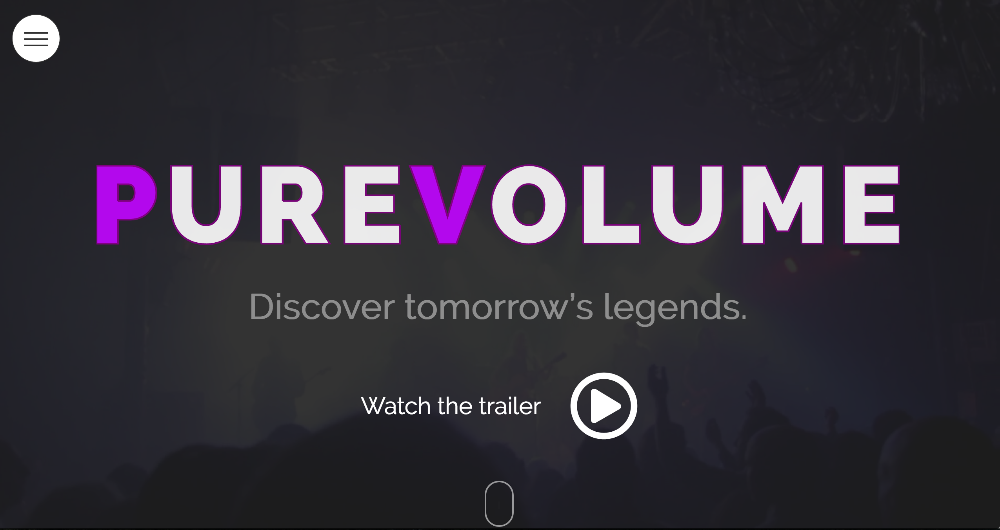

# Pure Volume Website



Our two page website redesign for Pure Volume, including the home page and origin page.

## Features

* Logo Animation
* Custom Video Player
* CSS Timeline
* Preview Content Sections

## Getting Started

### Prerequisites

To locally host this website, you'll need Git installed on your computer.
[See detailed install instructions here.](https://gist.github.com/derhuerst/1b15ff4652a867391f03)

### Installing

From the command line:

```
# Initialize git

$ git init

# Clone this repository

$ git clone https://github.com/EmmaBlue/Blue_E_Angelozzi_C_Atkinson_J_Unger_H_Boyden_D_PUREVOLUME.git

# Go into the repository

$ cd Blue_E_Angelozzi_C_Atkinson_J_Unger_H_Boyden_D_PUREVOLUME
```

And you're done!

## Built With

* [CSS Grid](https://cssreference.io/css-grid/)
* [CSS Flexbox](https://cssreference.io/flexbox/) - Dependency Management
* [Javascript](https://www.javascript.com/) - Used for custom video player

## Authors

* [**Camillo Angelozzi**](https://github.com/cangelozzi) - *Developer*
* [**Jacob Atkinson**][https://github.com/jiatkinson] - *Video and Motion Graphics*
* [**Emma Blue**](https://github.com/EmmaBlue) - *Project Manager*
* [**Dan Boyden**](https://github.com/OfficialDboyden) - *Designer*
* [**Helen Unger**](https://github.com/HelenUnger) - *Developer*

## License

This project is licensed under the [MIT License] (https://opensource.org/licenses/MIT).

## Acknowledgments

* Video Player Inspiration - [Northern.co][https://www.northern.co/]
* Content Section Inspiration - [Pyoneer Magazine](https://dribbble.com/shots/2117893-Pyoneer-Blog-Magazine-Layout/attachments/384238)
